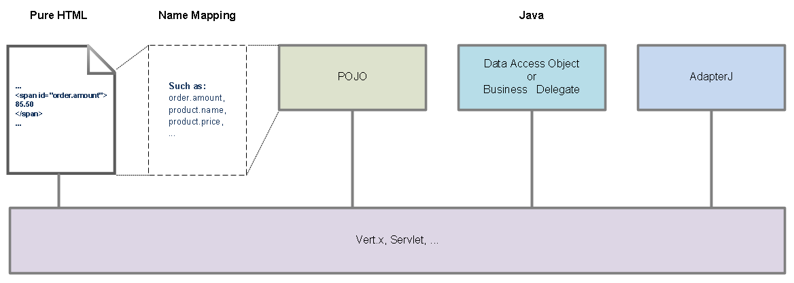
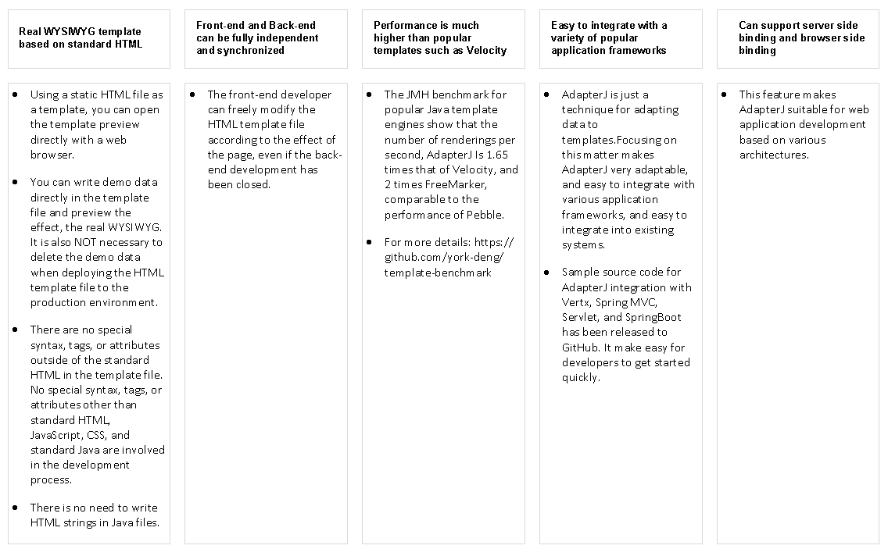
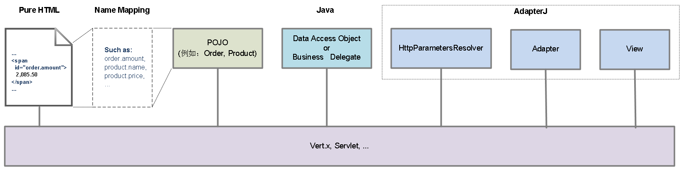
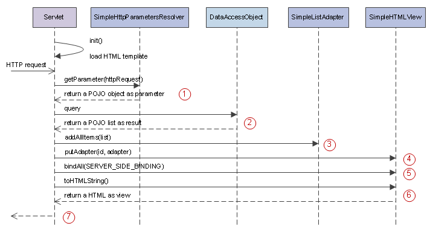

# Why AdapterJ？
*点击[这里](https://github.com/york-deng/adapterj/blob/master/README_CN.md)阅读[为什么需要AdapterJ (中文)](https://github.com/york-deng/adapterj/blob/master/README_CN.md)*

## A Brief Explanation   

AdapterJ is a real WYSIWYG (what you see is what you get), java-based, high-performance Web Layer framework. Its design goals are: 

* Separate HTML and Java completely. 
* Do NOT introduce any special syntax, tags, tag attributes other than standard HTML and standard Java. 
* High performance. 

<div align="center">  
   
<p>Figure 1: Typical web application architecture based on AdapterJ (Simplified)</p>   
</div>

<br/>

The features and benefits of Web application development based on AdapterJ are as follows:
<div align="center">  
   
<p>Table 1: The features and benefits of work with AdapterJ</p>   
</div>

The [JMH benchmark for popular Java template engines](https://github.com/york-deng/template-benchmark) was forked from [mbosecke/template-benchmark](https://github.com/mbosecke/template-benchmark), no more modifications except for adding AdapterJ.

The thinking of web application development based on AdapterJ is：```Write a static template file in standard HTML, and then you just need to adapt the data into the template in Java.```

Its approach is very similar to many front-end frameworks based on JavaScript and JSON, so I think these front-end developers will like it. It's also very similar to the GUI framework of Android and Java Swing, so I also think that many Java developers who are familiar with Android will like it.

<br/>

## A Detailed Explanation   
I will talk about the design idea of AdapterJ below.

It started on one day of March 2019.

After spending a long time focusing on building Android apps, I suddenly needed to build a web based managment application for an Android app. Time is very tight, we hope to reuse the source code of the Android app as much as possible, such as Domain Objects and Data Access Objects, so using Java to build the web application is the first choice. Even so, I still feel a strong sense of time pressure. I need to make a decision as soon as possible, but I can't choose the wrong way! In addition to reusing the Java source code already in the Android app, it is also necessary to ensure that the development of the web application is as simple and fast as possible, and I also have to make sure that the source code is easy to maintain in the future, and make sure it also has good performance when needed.

Emotionally, I expect to have a development method similar to Ruby on Rails, but in addition to the potential performance factors, Ruby on Rails can't reuse the Java code already in the Android app. In this case, choosing a non Java based solution, the development cost of the web application should be difficult to control, and the maintenance cost of the **Android app + web application as a whole** is difficult to reduce. Maintenance and upgrade of the source code is a long-term thing. In addition to working hard to ensure that you need to maintain as little source code as possible. I also need to make sure that the source code for the Android app and the web application is reused as much as possible.

This is a tricky thing! So I checked out the latest technical materials and demo source code of Struts, Spring MVC, Tapestry, FreeMarker, Thymeleaf, Velocity, JSF, ..., it’s been a long time since their beginning, but these are not any real change.

I went out to eat alone at noon, my brain kept running. I realized that there was a long-standing problem in the Web Layer. It was bad enough to mix Java with HTML and JavaScript. They also made a lot of new special tags and new special tag attributes, such as JSP tags, JSF tags, FreeMarker tags, Thymeleaf tag attributes, Velocity syntax, ..., they give us a bunch of toolboxes and a variety of exotic tools that go out of standard HTML and standard Java specifications. But NO ONE good enough :sweat:.

Looking back, MVC is a clean and capable guy in Windows MFC, Java Swing, Android, and even some web front-end frameworks based on JavaScript and JSON. Why is it becoming a troublesome here? This is not a complaint, but a technical issue!

In Java Swing and Android, which is used to associate simple data such as POJO, List, and Map with simple Views such as ListView and GridView, we call it Adapter. Using Adapter to handle the association of data with views, we call it Adaptive.


What are the M, V, and C in the Web Layer? If we can say that Struts Action, Spring MVC Controller is "simple Controller" (C), and POJO, Bean, Entity and their container such as List, Map is "simple Model" (M), what is "simple View" (V)?

Unlike Windows MFC, Java Swing, and Android applications, the web applications we talk about that's running in a production environment, its View is on a different machine than its Controller! For the browser, HTML is its data or document. But for web application, HTML is the View it wants to get. Usually, save these HTML code in a web page into a HTML file, and open this HTML file with a web browser, we can still see what it was like.

当我想到在这类Web应用中，HTML就是单纯的View，那应该怎样来实现一个干净能干的MVC呢？如果已经有一个用作视图模板的HTML，怎样把数据适配到HTML中才会得到类似Java Swing、Android那样的效果呢？为什么现有的模板技术始终有种如鲠在喉的感觉:confounded:？

原因不难想到，```从PHP到JSP、JSF，甚至Thymeleaf，它们都“污染”了标准的HTML，它们各自定义的各种特殊标签与特殊属性，除了用于把数据适配到HTML中，并没有其他的用处！```一个好的技术方案，不应该让人看到这些原本需要隐藏在接口(Interface)下的东西。```标准的HTML、标准的JavaScript、标准的CSS、标准的Java，这些是编程接口，是大家需要知道的语法、标签、属性，这里边不应该包括哪些由应用开发框架定义的语法、标签、属性。```

我们不要由应用开发框架定义的语法、标签和属性，也不要把不同的东西混在一起再交给别人。

通过在一个Servlet中直接输出HTML，可以得到动态网页。但这通常会需要我们在Servlet中拼接HTML字符串。这是个用HTML“污染”Java的例子。此时此景，另一个角度，既然HTML就是Web应用中单纯的视图，那Servlet就应该是单纯的控制器了。Servlet原本就是控制器，怎么能够把完全属于View的代码，大段大段的放入到Controller当中。

为什么不是Java“污染”了HTML，就是HTML“污染”了Java？要不然就一定要定义一些新的语法、标签或者属性，然后让它们去“污染”HTML与Java。一个应用开发框架引入一些新的语法、标签或者属性，甚至是一件更糟糕的事情，很不幸，JSP竟然全都做到了:smiling_imp:！

在我们讨论的这类Web应用中，HTML与Java，原本就一个属于浏览器端，一个属于服务器端。原本HTML最好就静静的躺在哪里保持它本来的样子，等待被送到浏览器端。只是，如此这般的岁月静好！哪我们需要的动态网页呢？

别急，…

另一个问题，为什么很多基于JavaScript与JSON的Web前端应用，反而还可以是一副既干净又能干的样子？这种应用架构下服务端只需要负责提供数据，数据与视图的适配或者称为绑定由JavaScript来完成。JavaScript可以方便的访问HTML的DOM结构，因此JavaScript完全可以做到。至于是否做得够好，则由前端应用开发框架的设计者与开发者决定。

既然JavaScript能够访问HTML的DOM结构，因此有能力在数据绑定这件事上干得挺不错。为什么不让Java也通过访问HTML的DOM结构来完成数据绑定呢？

这样的话，Java代码就可以通过getElementById找到那些需要写入数据的HTML标签。如果把这些HTML标签的id值写成object.property的形式，例如order.amount、product.name、product.price等等，那通过命名的约定我们就已经建立起了POJO、Bean、Entity们与HTML标签们的对应关系了！

这是个不错的想法，或许性能有点问题，但直觉上这是可以解决的。

除了通过Java访问HTML的DOM结构，还可以把HTML、数据与JavaScript代码一并输出到浏览器端，在body的onload事件触发时，由JavaScript完成数据绑定，更新网页的显示结果。这是一种可以改善性能的方式，缺点是用JavaScript输出数据对搜索引擎不友好，只适用于某些应用场景。

另一个改善性能的方式，与JSP改善性能的方式思路类似。基于不同的HTML模板动态生成不同的被称为视图加速器(ViewAccelerator)的Java类，在这些视图加速器中完成数据与HTML字符串的拼接。预计这种方式可望获得的性能，应该能够接近在Servlet或Verticle中拼接并输出HTML字符串的性能。JSP的性能优化方式，应用服务器在运行时把JSP动态编译成一个Servlet的过程对应用开发人员来说可以是完全不可见的，同样动态生成视图加速器的过程对应用开发人员也可以是完全不可见的。

这时我已经有了它的名字，AdapterJ。

这个名字意指，Web应用开发中需要我们用Java或者任何基于Java的技术解决的Web层的问题，不是关于View，而是关于Adapter。

HTML文件就是Web应用的唯一的视图，还是一个极具灵活性的视图。与之相匹配，我们需要优雅简洁同时又极具灵活性的Adapter！

出于项目的时间压力，我用一两天写好了足够用的部分。剩下的部分，我在之后花了大约几个星期补充完整。

<div align="center">  
   
<p>Figure 2: AdapterJ core class diagram</p>   
</div>

<br/>

<div align="center">  
   
<p>Figure 3: Typical web application architecture based on AdapterJ</p>   
</div>

<br/>

<div align="center">  
   
<p>Figure 4: Typical request response process of the web application based on AdapterJ (sequence diagram)</p>   
</div>

<br/>

<div align="center">  
   
<p>Figure 5: JMH benchmark of the most popular Java template engines </p>   
</div>

<br/>
