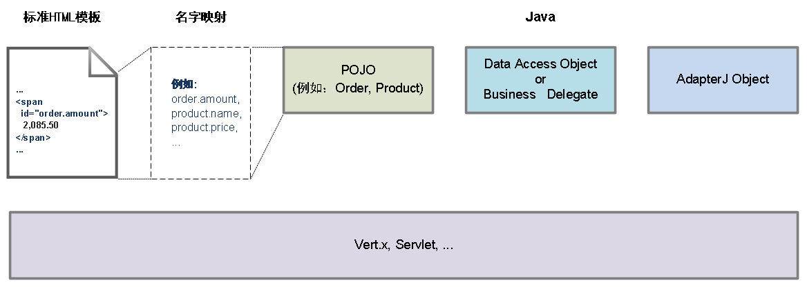
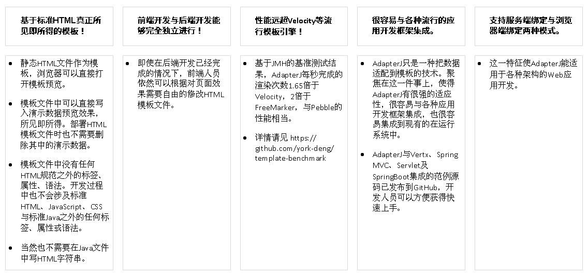
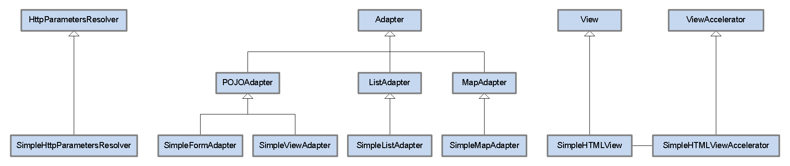
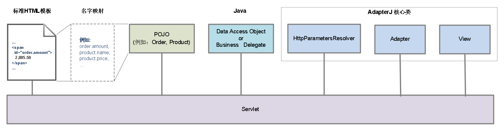
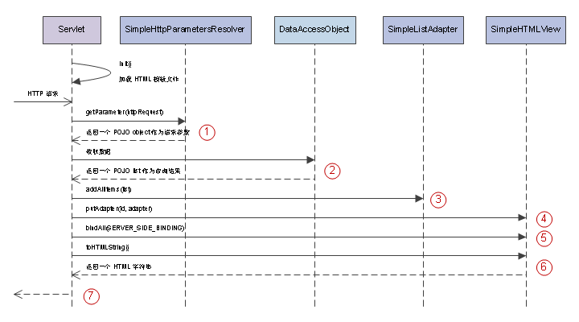

# 为什么需要AdapterJ？

## 一. 一个简要的版本：

AdapterJ是一个真正所见即所得，基于Java，高性能Web层开发框架，其设计目标是：   

* HTML与Java彻底分离；
* 不引入标准HTML与标准Java之外的任何语法、标签或属性；
* 高性能。

  
   

图1: 基于AdapterJ的典型Web应用架构 (简图) 
   

 

基于AdapterJ进行Web应用开发获得的特点与利益如下：

  
   

表1: 基于AdapterJ的特点和利益
   

上文[基于JMH的基准测试](https://github.com/york-deng/template-benchmark)项目，是从[mbosecke/template-benchmark](https://github.com/mbosecke/template-benchmark)项目Fork出来，未做更多修改，仅添加了对AdapterJ的支持。

 

用AdapterJ做Web应用开发的思想是：用完全基于标准HTML的静态文件做好模板，然后你就只需要在Java中把数据适配给模板。

这与许多基于JavaScript与JSON的前端应用框架很相似，因此我认为这些前端开发者会喜欢它；这也与Android以及Java Swing的图形界面框架非常相似，因此我也认为很多熟悉Android的Java开发者会喜欢它。

 

## 二. 一个详细的版本：

事情从2019年3月的一天开始。

很长一段时间主要把精力花在Android应用之后，突然转到为一个Android应用做一个数据维护的Web后台。时间很紧，希望重用到Android应用的数据域对象与数据库访问的代码，用Java来完成这个Web应用就成了首先的选择。即便是这样，我还是感受到很强的时间压迫感。需要尽快做决定，又不能做错决定！除了需要尽可能重用Android应用已有的Java代码，还需要确保Web应用的开发尽可能简单快捷，还得努力确保这些代码以后能够容易维护，并且还能在需要时确保性能。

情感上我期待有类似Ruby on Rails那样快捷的开发方式，只是除了潜在的性能因素，Ruby on Rails这类方案不能重用Android应用已有的Java代码，那样的话，Web应用的开发周期将很难得到的控制，并且Android应用+Web应用整体的维护成本也很难降下来。代码的维护和升级是一个长期的事情，除了努力确保需要维护尽可能少的代码，还需要确保Android应用与Web应用有尽可能多的代码保持一致。

这是一件棘手的事情！翻出Struts、Spring MVC、Tapestry、FreeMarker、Thymeleaf、Velocity、JSF、...最新的技术资料与演示源码，天啦，从开始出现到现在已经很长时间了，这些技术并没有什么真正的变化！

中午独自一人出去吃饭，大脑不停的运转，我意识到Web层长期以来的一个问题，把Java与HTML、JavaScript混在一起已经够糟糕了，他们还要搞出一大堆新的标签与新的属性，JSP标签、JSF标签、FreeMarker的标签、Thymeleaf的属性、Velocity的语法、...，他们给我一大堆工具箱和各种各样越出HTML、Java规范的奇门工具，却没有一个足够顺手的。

回头想一下，MVC在Windows MFC、Java Swing、Android，甚至一些基于JavaScript与JSON的Web前端框架，都是一副既干净又能干的样子，为什么到了这里在Web层就成了这副啰嗦麻烦还拖泥带水的样子？这不是个牢骚，而是个技术问题！

在Java Swing与Android中，把POJO、List、Map这类单纯的数据与诸如ListView、GridView这类单纯的View关联起来的，我们称为Adapter。Adapter处理数据与视图的关联，我们称为适配(Adaptive)。

回到Web层，Web层的MVC分别是什么呢？如果可以说Struts的Action、Spring MVC的Controller都是单纯的控制器(Controller)，POJO、Bean、Entity以及它们的容器List、Map都是单纯的模型(Model)，那么，什么才是单纯的视图(View)？

与Windows MFC、Java Swing、Android这些应用不同，我们讨论的这类Web应用在生产环境下运行的时候，它的View与它的Controller在相距遥远的不同机器上！对浏览器来说，HTML是它的数据或称文档。但是对Web应用来说，HTML就是它希望得到的View。把网页的HTML保存下来然后再用浏览器打开，通常我们仍然可以看到它是之前的样子。

当我想到在这类Web应用中，HTML就是单纯的View，那应该怎样来实现一个干净能干的MVC呢？如果已经有一个用作视图模板的HTML，怎样把数据适配到HTML中才会得到类似Java Swing、Android那样的效果呢？为什么现有的模板技术始终有种如鲠在喉的感觉？

原因不难想到，从PHP到JSP、JSF，甚至Thymeleaf，它们都“污染”了标准的HTML，它们各自定义的各种标签与属性除了解决把数据适配到HTML中，并没有其他的用处。一个好的技术方案，不应该让人看到这些原本需要隐藏在接口(Interface)下的东西。标准的HTML是接口，标准的JavaScript是接口，标准的CSS是接口，标准的Java是接口，这些是大家都需要遵循的规范，这些才是大家都需要知道的语法、标签和属性。

我们不要由应用开发框架定义的语法、标签和属性，也不要把不同的东西混在一起再拿别人。

通过在一个Servlet中直接输出HTML，可以得到动态网页。但这通常会需要我们在Servlet中拼接HTML字符串。这是个用HTML“污染”Java的例子。此时此景，另一个角度，既然HTML就是Web应用中单纯的视图，那Servlet就应该是单纯的控制器了。Servlet原本就是控制器，怎么能够把完全属于View的代码，大段大段的放入到Controller当中。

为什么不是Java“污染”了HTML，就是HTML“污染”了Java？要不然就一定要定义一些新的语法、标签或者属性，然后让它们去“污染”HTML与Java。一个应用开发框架引入一些新的语法、标签或者属性，甚至是一件更糟糕的事情，很不幸，JSP竟然全都做到了！

在我们讨论的这类Web应用中，HTML与Java，原本就一个属于浏览器端，一个属于服务器端。原本HTML最好就静静的躺在哪里保持它本来的样子，等待被送到浏览器端。只是，如此这般的岁月静好！哪我们需要的动态网页呢？

别急，…

另一个问题，为什么很多基于JavaScript与JSON的Web前端应用，反而还可以是一副既干净又能干的样子？这种应用架构下服务端只需要负责提供数据，数据与视图的适配或者称为绑定由JavaScript来完成。JavaScript可以方便的访问HTML的DOM结构，因此JavaScript完全可以做到。至于是否做得够好，则由前端应用开发框架的设计者与开发者决定。

既然JavaScript能够访问HTML的DOM结构，因此有能力在数据绑定这件事上干得挺不错。为什么不让Java也通过访问HTML的DOM结构来完成数据绑定呢？

这样的话，Java代码就可以通过getElementById找到那些需要写入数据的HTML标签。如果把这些HTML标签的id值写成object.property的形式，例如order.amount、product.name、product.price等等，那通过命名的约定我们就已经建立起了POJO、Bean、Entity们与HTML标签们的对应关系了！

这是个不错的想法，或许性能有点问题，但直觉上这是可以解决的。

除了通过Java访问HTML的DOM结构，还可以把HTML、数据与JavaScript代码一并输出到浏览器端，在body的onload事件触发时，由JavaScript完成数据绑定，更新网页的显示结果。这是一种可以改善性能的方式，缺点是用JavaScript输出数据对搜索引擎不友好，只适用于某些应用场景。

另一个改善性能的方式，与JSP改善性能的方式思路类似。基于不同的HTML模板动态生成多个可以称为加速器(Accelerator)的Java类，在这些加速器中完成数据与HTML字符串的拼接。预计这种方式可望获得的性能，应该能够接近Servlet的性能。应用服务器将JSP动态生成一个Servlet的过程对应用开发人员来说可以是完全不可见的，同样动态生成加速器的过程对应用开发人员也可以是完全不可见的。

这时我已经有了它的名字，AdapterJ。

这个名字意指，Web应用开发中需要我们用Java或者变种的Java解决的Web层的问题，不是关于View，而是关于Adapter。

HTML文件就是Web应用的唯一的视图，还是一个极具灵活性的视图。与之相匹配，我们需要优雅简洁同时又极具灵活性的Adapter！

出于项目的时间压力，我用一两天写好了足够用的部分。剩下的部分，我在之后花了大约几个星期补充完整。

  
   

图2: AdapterJ核心类
   

 

  
   

图3: 基于AdapterJ的典型Web层架构
   

 

  
   

图4: 基于AdapterJ的应用典型请求响应过程 (序列图) 
   

 

  
   

图5: JMH benchmark of the most popular Java template engines 
   

 
